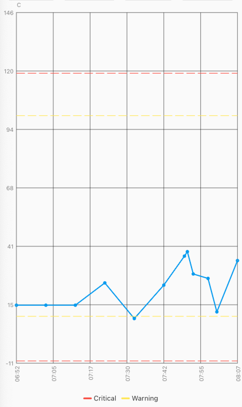
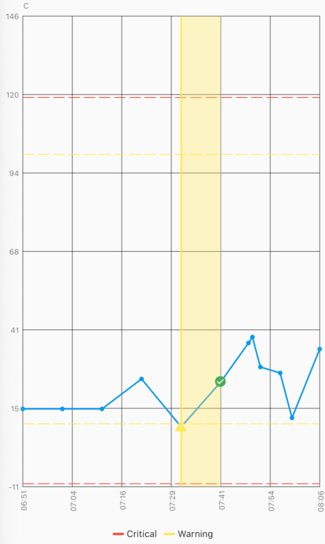

# fl_animated_linechart

An animated chart library for flutter.
 - Support for datetime axis
 - Multiple y axis, supporting different units
 - Highlight selection
 - Animation of the chart
 - Possibility of adding legends
 - Support for both horizontal and vertical markerlines 
 - Tested with more than 3000 points and still performing

There are currently two different charts:
 - line chart
 - area chart

## Getting Started

Try the sample project or include in your project.

Highlight for the line chart:

Area chart:

# Example code:

    LineChart lineChart = LineChart.fromDateTimeMaps([line1, line2], [Colors.green, Colors.blue]);

    return Scaffold(
      appBar: AppBar(
        title: Text(widget.title),
      ),
      body: Container(
        child: Column(
            mainAxisSize: MainAxisSize.max,
            mainAxisAlignment: MainAxisAlignment.spaceBetween,
            crossAxisAlignment: CrossAxisAlignment.stretch,
            children: [
              Expanded(child: AnimatedLineChart(lineChart)),
            ]
        ),
      ),
    );

# Example code with horizontal markerlines and legends:

    LineChart lineChart = LineChart.fromDateTimeMaps([line1, line2, line3, line4, line5], [Colors.blue, Colors.red, Colors.red, Colors.yellow, Colors.yellow], ['C', 'C', 'C', 'C', 'C'], tapTextFontWeight: FontWeight.w700,);

    To define a line as a horizontal dashed markerline:
      lineChart.lines[1].isMarkerLine = true;
      lineChart.lines[2].isMarkerLine = true;
      lineChart.lines[3].isMarkerLine = true;
      lineChart.lines[4].isMarkerLine = true;
    
    Or: 
    lineChart.lines.skip(1).forEach((line) {
          line.isMarkerLine = true;
        });
    
    Legends:
    A Legend has the following constructor:
        const Legend({this.title, this.color, this.icon, this.style});
    
    You can choose to either have a short line or an Icon as the first part of the legend before the title. If no Icon is defined, then a short line will be shown. 
    You can change the Color of the line and the TextStyle of the String title. 
    You can add however many Legend you want. 

      return Scaffold(
      appBar: AppBar(
        title: Text(widget.title),
      ),
      body: Container(
        child: Column(
          mainAxisSize: MainAxisSize.max,
          mainAxisAlignment: MainAxisAlignment.spaceBetween,
          crossAxisAlignment: CrossAxisAlignment.stretch,
          children: [
            Expanded(
              child: AnimatedLineChart(
                chart,
                toolTipColor: Colors.white,
                gridColor: Colors.black54,
                textStyle: TextStyle(fontSize: 10, color: Colors.black54),
                showMarkerLines:
                    true, // If this value is not set to true, all defines lines will be filled lines and not dashed
                legends: [
                  Legend(title: 'Critical', color: Colors.red),
                  Legend(title: 'Warning', color: Colors.yellow),
                ],
              ),
            ),
          ],
        ),
      ),
    );

# Example code with horizontal and vertical markerlines along with icons on the chart and legends:

It is possible to define a maximum of two vertical markerlines. 
The verticalMarker variable is a List<DateTime> and the length can be >= 2. 
If two vertical markerlines are defined, the area between the two lines will be filled with a color that can be defined with verticalMarkerColor.

It is possible to add an Icon on the point where the vertical markerline crosses the y-axis value by defining the verticalMarkerIcon. 
The verticalMarkerIcon variable takes a List<Icon> and the lenght must be equal to the length of the verticalMarker variable. 
The possibility of adding a colored background to the icons have been added and can be defined with iconBackgroundColor which takes a Color. 

      return Scaffold(
      appBar: AppBar(
        title: Text(widget.title),
      ),
      body: Container(
        child: Column(
          mainAxisSize: MainAxisSize.max,
          mainAxisAlignment: MainAxisAlignment.spaceBetween,
          crossAxisAlignment: CrossAxisAlignment.stretch,
          children: [
            Expanded(
              child: AnimatedLineChart(
                chart,
                toolTipColor: Colors.white,
                gridColor: Colors.black54,
                textStyle: TextStyle(fontSize: 10, color: Colors.black54),
                showMarkerLines:
                    true, // If this value is not set to true, all defines lines will be filled lines and not dashed
                legends: [
                  Legend(title: 'Critical', color: Colors.red),
                  Legend(title: 'Warning', color: Colors.yellow),
                ],
                verticalMarker:[
                          DateTime.now()
                              .subtract(Duration(minutes: 40))
                              .toLocal(),
                          DateTime.now()
                              .toLocal()
                              .subtract(Duration(minutes: 30)),
                        ],
                  verticalMarkerColor: Colors.yellow,
                  verticalMarkerIcon: [
                    Icon(
                      Icons.report_problem_rounded,
                      color: Colors.yellow,
                    ),
                    Icon(
                      Icons.check_circle_rounded,
                      color: Colors.green,
                    ),
                  ],
                  iconBackgroundColor: Colors.white,
              ),
            ),
          ],
        ),
      ),
    );

# The example app, can toggle between line chart and area chart.

